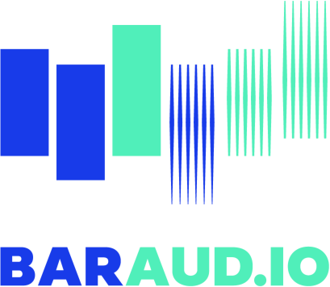

&nbsp;

[BarAudio](https://baraud.io/) is an Android app available on the [Play Store](https://play.google.com/store/apps/details?id=com.sommerengineering.baraudio) as a monthly subscription. It's written in Kotlin with MVVM architecture using Compose, Firebase, and Google Cloud Functions on the backend. The app provides audible realtime alerts for financial securities including stocks, futures, options, and crypto. The ecosystem of market exchanges, brokers, and third party platforms emits financial data in realtime. To be an effective trader, digital charts must be constantly monitored throughout the day. This causes eye strain and mental fatigue. Audio alerts from a mobile device provide an alternative source of information, allowing investors to step away from their screens with confidence.

&nbsp;

TBD ...

&nbsp;

&nbsp;

&nbsp;

[Electrify America](https://www.electrifyamerica.com/) is an Android app available on the [Play Store](https://play.google.com/store/apps/details?id=com.ea.evowner). It's written in Java with MVVM architecture and support for custom Google Maps, Near Field Communication (NFC), and WebSocket connections. The app enables users to find a nearby charging station, charge their vehicle, and manage the charging session at over 400+ locations.
